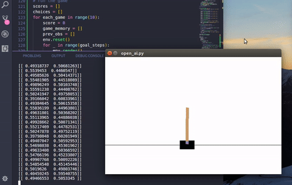

# Neural networks

>From randomness to score 162



## Requirements

- [Anaconda](https://conda.io/docs/user-guide/install/index.html)
- Tensorflow
- [OpenAI gym](https://github.com/openai/gym/blob/master/README.rst#installing-everything)
- [TFlearn](http://tflearn.org/installation/)

## Setup

```sh
clone repo
cd neural-networks

conda install -c anaconda tensorflow-gpu

pip install -r requirements.txt

apt-get install -y python-numpy python-dev cmake zlib1g-dev libjpeg-dev xvfb libav-tools xorg-dev python-opengl libboost-all-dev libsdl2-dev swig

# clonning gym into '~/' by organization, but u can clone wherever u want
cd ~/
git clone https://github.com/openai/gym.git
cd gym
pip install -e '.[all]'
```
